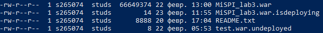

22.02.2023

## Лабораторная работа №3 по МиСПИ (Методы и средства программной инженерии)

### 1. Текст задания

Написать сценарий для утилиты *Apache Ant*, реализующий компиляцию, тестирование и упаковку в jar-архив кода проекта из *лабораторной работы №3* по дисциплине "Веб-программирование".<br>

Каждый этап должен быть выделен в отдельный блок сценария; все переменные и константы, используемые в сценарии, должны 
быть вынесены в отдельный файл параметров; MANIFEST.MF 
должен содержать информацию о версии и о запускаемом классе.<br>

Cценарий должен реализовывать следующие цели (targets):<br>

**compile** -- компиляция исходных кодов проекта.<br>
**build** -- компиляция исходных кодов проекта и их упаковка в исполняемый jar-архив. Компиляцию исходных кодов реализовать посредством вызова цели compile.<br>
**clean** -- удаление скомпилированных классов проекта и всех временных файлов (если они есть).<br>
**test** -- запуск junit-тестов проекта. Перед запуском тестов необходимо осуществить сборку проекта (цель build).<br>
**doc** - добавление в MANIFEST.MF MD5 и SHA-1 файлов проекта, а также генерация и добавление в архив javadoc по всем классам проекта.<br>
**team** - осуществляет получение из svn-репозитория 4 предыдущих ревизий, их сборку (по аналогии с основной) и упаковку получившихся jar-файлов в zip-архив. Сборку реализовать посредством вызова цели build.<br>

### 2. Выполнение
**1. Определяемся с версией wildfly:**<br>
Для начала нужно определиться на какой-же версии будет проиcходить запуск нашего приложения. Относительно недавно в 2020 году
JavaEE переехал в нейм-спейс JakartaEE 
([кратко](https://ru.stackoverflow.com/questions/1434938/%D0%92-%D1%87%D0%B5%D0%BC-%D1%80%D0%B0%D0%B7%D0%BD%D0%B8%D1%86%D0%B0-%D0%BF%D0%B0%D0%BA%D0%B5%D1%82%D0%BE%D0%B2-javax-%D0%B8-jakarta),
[подробнее](https://blogs.oracle.com/javamagazine/post/transition-from-java-ee-to-jakarta-ee)). Были обновлены сервера и пакеты, которые они поддерживают из коробки. [Здесь](https://www.wildfly.org/downloads/) можно найти подходящую версию wildfly.
Я запускал 3-юю лаб. по веб-программированию на версии Java EE Full & Web Distribution 20.0.1.Final, сборка от 7 июля 2020 года. 
<br><br>**2. Настройка wildfly с PostgreSQL:**<br>
Есть несколько способов привязать базу данных PostgreSQL. Я буду пользоваться методом через ручную настройку драйвера.
Для *standalone* версии сервера.
Краткий гайд, как вы можете настроить сервер [по ссылке](https://marco.dev/use-postgresql-with-wildfly).<br>
Что мы делаем:
- Качаем jdbc-драйвер для PostgreSQL ([можно тут](https://mvnrepository.com/artifact/org.postgresql/postgresql)).
Для этого переходим в подходящуюю версию, в таблице на уровне *Files* будет ссылка на скачивание *jar*-файла.
- переходим по wildfly-<version>/modules/system/layers/base/org создаем здесь папки со структурой postgresql\main.
В папку main переносим наш драйвер и создаем файл module.xml со следующим содержимым:<br>
```xml
<?xml version='1.0' encoding='UTF-8'?> 

<module xmlns="urn:jboss:module:1.3" name="org.postgresql"> 

    <resources>
        <!-- конкретная версия драйвера -->
        <resource-root path="postgresql-<version>.jar"/> 
    </resources> 
 
    <dependencies> 
        <module name="javax.api"/> 
        <module name="javax.transaction.api"/> 
    </dependencies> 
</module>
```
стркуктура:<br>
```
wildfly-<version>\
    modules\
        system\
            layers\
                base\
                    org\
                        postgresql\
                            main\
                                postgresql-<version>.jar
                                module.xml
```
- теперь необходимо привязать наш драйвер в конфиге wildfly-<version>/standalone/configuration/standalone.xml.
Ищем такие вложенные теги \<server>\<profile>\<subsystem xmlns="urn:jboss:domain:datasources:6.0">
(**ВНИМАНИЕ** в зависимости от версии wildfly сервера версия после datasource может отличаться).
У меня в данном теге уже была настроенна in-memory база данный h2.
Необходимо добавить datasource с конфигурацией подключения к нашей бд и указание на сам драйвер.<br>
<br>Так выглядет поисание datasource:
```xml
<datasource jndi-name="java:/PostgresDS" pool-name="PostgresDS" enabled="true">
    <!--настройте вашу ссылку для подключения к PostgreSQL-->
    <connection-url>jdbc:postgresql://localhost:5432/postgres</connection-url>
    <driver>postgresql</driver>
    <security>
        <!-- настройти имя вашего пользователя PostgreSQL-->
        <user-name>user</user-name>
        <!-- настройти пвроль от вашего пользователя PostgreSQL-->
        <password>password</password>
    </security>
</datasource>
```
Так выглядит описание driver:
```xml
<driver name="postgresql" module="org.postgresql">
    <!-- выбираете ваш драйвер, по дефолту должен быть этот-->
    <driver-class>org.postgresql.Driver</driver-class>
</driver>
```
Если говорить в контексте se.ifmo.ru пользователь PostgreSQL совпадает с вашим логином на se.ifmo.ru (e.g. s273151).
<br>На момемент написания статьи пароль находитсья в вашей домашней дериктории в скрытом файле .pgpass. Можете вывести его содержимое командой `cat .pgpass`.
<br>[По ссылке](https://stackoverflow.com/questions/3582552/what-is-the-format-for-the-postgresql-connection-string-url) 
можно посмотреть как строится url для подключения к PostgreSQL. От себя добавлю, что можно преднастроить
searchpath, то есть схему с которой будет работать PostgreSQL, url будет примерно следующим
`jdbc:postgresql://localhost:5432/mydatabase?options=-csearch_path=schema_name`, либо `jdbc:postgresql://localhost:5432/mydatabase?searchpath=myschema`. Но для se.ifmo.ru в этом нет необходимости, так как в бд вам выделяется лишь одна схема, ее имся совпадает с вашим логином на se.ifmo.ru. 
<br>PostgreSQL находится по адресу pg, порт стандартный 5432.
<br>Как примерно должен выглядить файл standalone.xml:
```xml
...
    <subsystem xmlns="urn:jboss:domain:datasources:6.0">
        <datasources>
            <datasource jndi-name="java:jboss/datasources/ExampleDS" pool-name="ExampleDS" enabled="true" use-java-context="true" statistics-enabled="${wildfly.datasources.statistics-enabled:${wildfly.statistics-enabled:false}}">
                <connection-url>jdbc:h2:mem:test;DB_CLOSE_DELAY=-1;DB_CLOSE_ON_EXIT=FALSE</connection-url>
                <driver>h2</driver>
                <security>
                    <user-name>sa</user-name>
                    <password>sa</password>
                </security>
            </datasource>
            <datasource jndi-name="java:/PostgresDS" pool-name="PostgresDS" enabled="true">
                <connection-url>jdbc:postgresql://pg:5432/studs</connection-url>
                <driver>postgresql</driver>
                <security>
                    <user-name>s203234</user-name>
                    <password>pueYjZ2cLg0KJpKN</password>
                </security>
            </datasource>
            <drivers>
                <driver name="h2" module="com.h2database.h2">
                    <xa-datasource-class>org.h2.jdbcx.JdbcDataSource</xa-datasource-class>
                </driver>
                <driver name="postgresql" module="org.postgresql">
                    <driver-class>org.postgresql.Driver</driver-class>
                </driver>
            </drivers>
        </datasources>
    </subsystem>
...
```
<br>Теперь подключение к бд должно проиходить без проблем.
<br><br>**3. Запуск сервера  и deploy веб-приложения**
<br>Запуск осуществляется с помощью скрипта `wildfly-<version>/bin/standalone.<sh|bat>`. В зависимости от ваше операционной системы необходимо выбрать конкретный интерпретатор.
<br> Деплой приложения на сервер осуществляется копированием `war` файла в директорию `wildfly-<version>/standalone/deployments`.
После копирования сервер автоматически пытается задеплоить ваш проект. Результаты деплоя можно нюлбдать в логах запущенного сервера, что не всегда удобно. Другой вариант следить за проиходящим 
в директории `deployments`, сервер будет создать файлы, сигнализирующие о успешности или неуспешности деплоя. 
Внутри файлов с расширением `.failed`, так же будет находиться описание ошибки.
<br>Отслеживать деплой можн окомандой `ls -l` находясь все в той же дериктории.
Команда выдаст нам время последней модификации и непосредственно название самих файлов:
<br>
По дефолту приложение будет доступно по адресу localhost:8080/<war_name>
<br><br>**4. Настройка apache ant**
<br>Как настроить apache ant и краткий гайд по нему можно прочитать по [ссылке](https://www.vogella.com/tutorials/ApacheAnt/article.html).
<br>Добавлю лишь, что для выполениня лабораторной работы базовой функциональности ant'а может не хватить.
В моем случае я дополнительно использовал библиотеку ant-contrib, где реализована функция propertyregex (у данной функции, либо в териминалогии ant'а task'и,
по моему мнению, есть баг, из-за которого мне пришлось использовать ее
3 раза, заключается он в том, что функция ищет лишь первое 
вхождение паттерна, не зависимо от указанного свойства `gloabl`).
<br>В некоторых вариантах потребуется копировать файл на удаленный сервер (смотерть target с имеем deploy-remote), 
потребуется библиотека jsch. Данные библиотеки находятся в директории ant-lib, либо можете скачать новые версия.
В файле build.xml уже преднастроен путь к библиотеке ant-contrib, а вот для запуска цели deploy-remote необходимо вручную указать ключ `-lib` и путь.
Выглядит примерно так: `ant -lib ant-lib deploy-remote`.
<br><br>**5. Работа с svn**
<br>Для базового понимания достаточно прочитать вводную часть гайда по [ссылке](https://svnbook.red-bean.com/en/1.7/svn.intro.quickstart.html).
<br>Последовательность команд выглядит примерно так:
- `svnadmin create <repo-name>` e.g. `svnadmin create lab3-repo`
- `svn import <proj> <repo-url>` e.g. `svn import /home/studs/s204343/mispi/lab3 file:////home/studs/s204343/mispi/repo`
- `svn checkout <url> <path>` e.g. `svn checkout file:////home/studs/s204343/mispi/repo lab3_workcopy`
